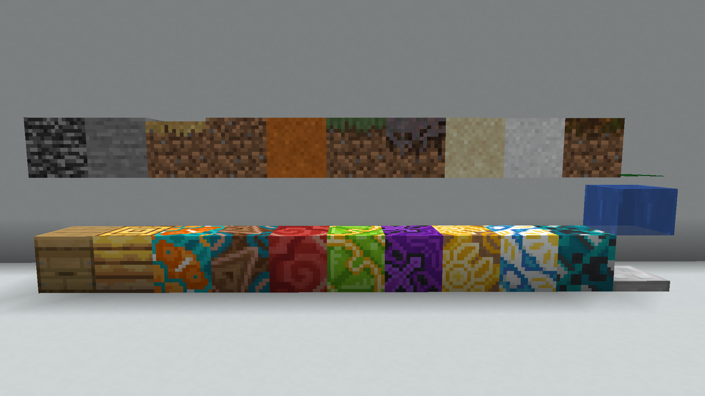
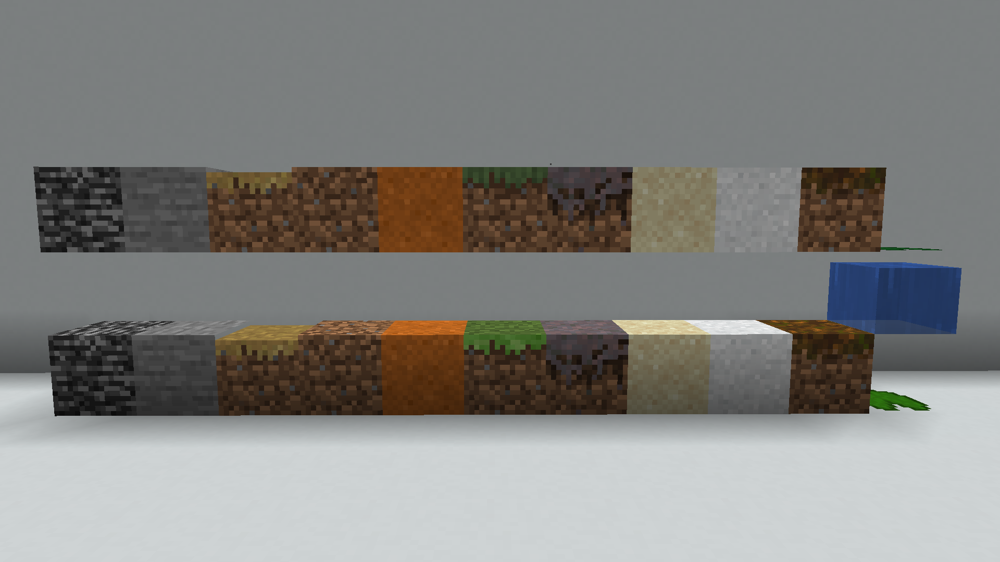
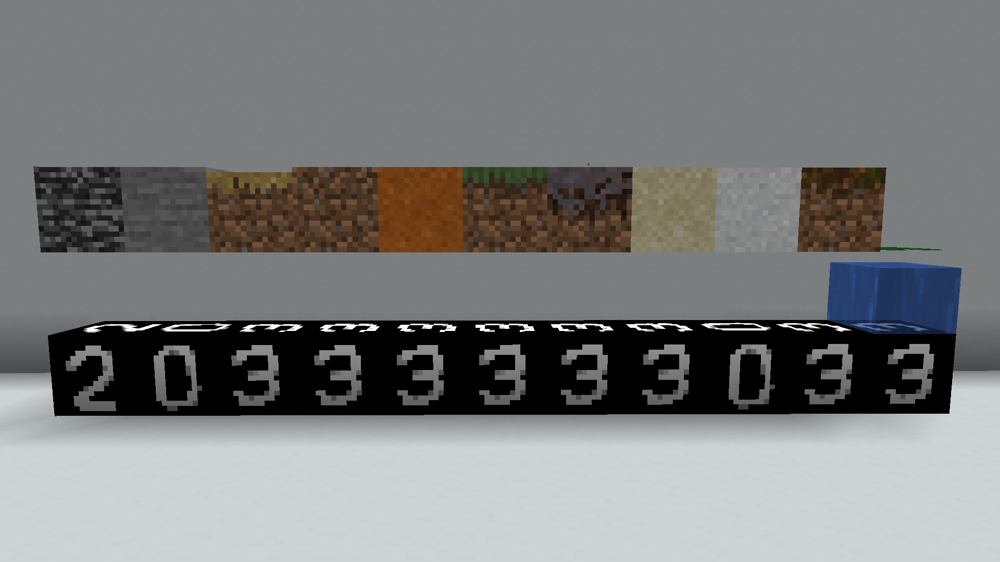

# Texture Rotation Reverser Java
- for vanilla and sodium texture rotations.
- multithreaded
- no netherrack support

## Getting texture rotations

### Datapack downloads

to get texture rotations you can install these two recourse packs:\
[Manual texture rotations](https://github.com/19MisterX98/TextureRotations/releases/download/1/Manual_texture_rotations.zip) \
[Textures to numbers](https://github.com/19MisterX98/TextureRotations/releases/download/1/Textures_to_numbers.zip)

### Usage
Manual texture rotations reskins blocks with block states to blocks with texture rotations. \
When you change the blockstate via debugstick these blocks will then change their rotation. 

Here is a list of the rotating blocks and thier replacement: 

<pre>
Bedrock:        Beehive fill level
Stone:          Bee nest fill level
Path block:     Orange glazed terracotta orientation
Dirt:           Brown glazed terracotta orientation
Red Sand:       Red glazed terracotta orientation
Grass block:    Lime glazed terracotta orientation
Mycelium:       Purple glazed terracotta orientation
Sand:           Yellow glazed terracotta orientation
Concrete powder:White glazed terracotta orientation
Podzol:         Cyan glazed terracotta orientation
Lily pad:       Iron trapdoor orientation
</pre>
#### before the manual texture rotation resource pack:

#### after the manual texture rotation resource pack:

Just rotate the blocks in your recreation as they are in the footage of your "vicitm" \
Pay attention that you got the direction of your recreation right. This tool doesnt support rotating cause im lazy. \
An easy way to get the direction is looking at the texture of blocks that dont have texture rotations.

## Numbering texture rotations

Now you can overlay the textures to numbers resource pack. \
It converts your textures to numbers that the program can use (who could have guessed)
#### after the textures to numbers resource pack:

## How to input data
In the TextureFinder class you can find an example on how the input data.
<pre>
formation.add(new RotationInfo(1, 0, 0, 1, true));
</pre>
The first 3 numbers are the relative coorinates to an origin block ingame that you have to pick.

This example shows rotation info about a block that is positioned 1 block in positive X direction from the origin. \
All blocks that you include need to have a relative postition to this origin block.

The fourth number is simply the rotation. Just plug in the number from the textures to numbers resource pack.

The boolean value should be set to false. \
Bedrock and stone have 2 possible side rotations. (acctually not rotations, the texture is flipped) \
If you only know the side rotation then you need to set this to true. \
All other blocks only rotate tops and bottoms.  (except netherrack, which I dont support)

## Search parameters
Configure them in the main class
- xMin / xMax: range of the scanned X coords
- zMin / zMax: range of the scanned Z coords
- yMin / yMax: range of the scanned Y coords
- threads: number of threads (between 4 and 16 for average pcs)
- mode: change between VanillaTextures/Vanilla12Textures/SodiumTextures/Sodium19Textures

Minecraft changed its random number generator a bunch of times so here is a table :)

| MC Version  | Mode                |
|-------------|---------------------|
| \>=1.12.2   | Vanilla12Textures   |
| 1.13-1.21.1 | Vanilla21_1Textures |
| 1.21.2+     | VanillaTextures     |

Sodium did it too :)

| Sodium Version | MC Version  | Mode                       |
|----------------|-------------|----------------------------|
| 1.0-4.1        | 1.16-1.18.2 | SodiumTextures             |
| 4.2-4.8        | 1.19-1.19.3 | Sodium19Textures           |
| 4.9+           | 1.19.3+     | Uses the MC implementation |

